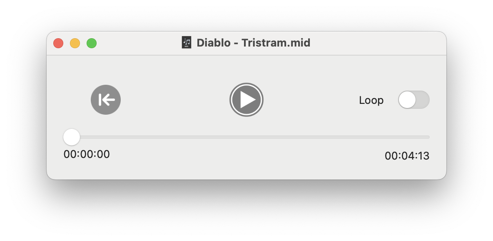

# APPlayMIDI
_A simple MIDI file player for MacOS._

Ever since 2009, when Apple deprecated the 32-bit QuickTime framework in favour of the newer AVKit, the Mac's flagship media player, QuickTime Player X has refused to play MIDI files. (Despite MIDI file types being associated with the app!)

The AVKit framework contains a perfectly good player for MIDI files: AVMIDIPlayer, so there's no excuse for not having an app that plays MIDI files. Here's my lightweight implementation.

Each document window contains a slider that both indicates and sets the current play position, and a 'rewind' button to return to the start of the track. Numerical counters show the play position and total duration.

The app contains one other feature: it can Copy the MIDI data from a document to the clipboard, so it can be pasted into apps that support pasting MIDI data.

Apps that support MIDI pasteboard include: Finale. 

### Future ###  
It would be nice to offer QuickLook previews of MIDI files in the Finder, but currently, QL plug-ins cannot be written in Swift.

