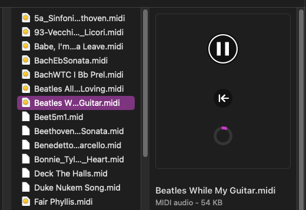

# APPlayMIDI
_A simple MIDI file player for MacOS._

Ever since 2009, when Apple deprecated the 32-bit QuickTime framework in favour of the newer AVKit, the Mac's flagship media player, QuickTime Player X has refused to play MIDI files. (Despite MIDI file types being associated with the app!)

The AVKit framework contains a perfectly good player for MIDI files: AVMIDIPlayer, so there's no excuse for not having an app that plays MIDI files. Here's my lightweight implementation.

 
Each document window contains a slider that both indicates and sets the current play position, and a 'rewind' button to return to the start of the track. Numerical counters show the play position and total duration.

The app contains a few other features: it can Copy the MIDI data from a document to the clipboard, so it can be pasted into apps that support pasting MIDI data.

Known apps that support MIDI pasteboard include: Finale. (Let me know of others.)

You can also drag the file icon from the titlebar into any app that supports MIDI dragging: e.g. Cubase, Dorico...

If you like this app, please consider buying me a drink!
https://paypal.me/agroovem

### QUICK LOOK! ###

APPlayMIDI now contains a Quick Look Extension, enabling MIDI files to be played directly in the Finder. 

The Preview panel, or Quick Look pop-up window, will display three objects: Play/pause button, rewind to start, and a progress indicator. Note that you need to press Play to start the preview (to stop files from auto-playing just by being selected in the Finder).

This feature is still 'a bit beta'; while it works, there are a few interface issues to sort out.

### Installation ###
Click on the Releases link above, or here: https://github.com/benwiggy/APPlayMIDI/releases. Download, unzip and move to the /Applications folder. You then need to right click on the app and select "Open". A dialog will come up, telling you that it is from an 'unidentified developer', but there should be an "Open" button.   
You may want to make APPlayMIDI the default file for opening MIDI files. Select a MIDI file, then _Get Info_ (File menu or Command I) select "APPlayMIDI", and then click "Change All".

The source files are included, for anyone who wants to help improve the quality of the code, add functionality, or use them as the basis of a new app. 

### OS Versions required and supported ###

v1.10 does need macOS 12, Monterey, for the Quick Look extension to work.
v.1.04 and 05 are Universal Binaries for Intel and Apple Silicon, and so require Big Sur to work.
v1.02 should work on earlier OSes.

### Future ###  
Some refinement of the Quick Look code, to enable different behaviours for the preview panel and the Quick Look pop-up window, would be nice.

v.1.10 Quick Look support added.  
v.1.05 Fixed an issue with a cropped slider in Monterey.  
v.1.04 Universal Binary for Intel and ARM Macs.
v.1.02 The app has been code-signed, but apparently that's still not enough to clear MacOS's quarantine.
v.1.01 fixes an issue where document windows did not cascade.  

